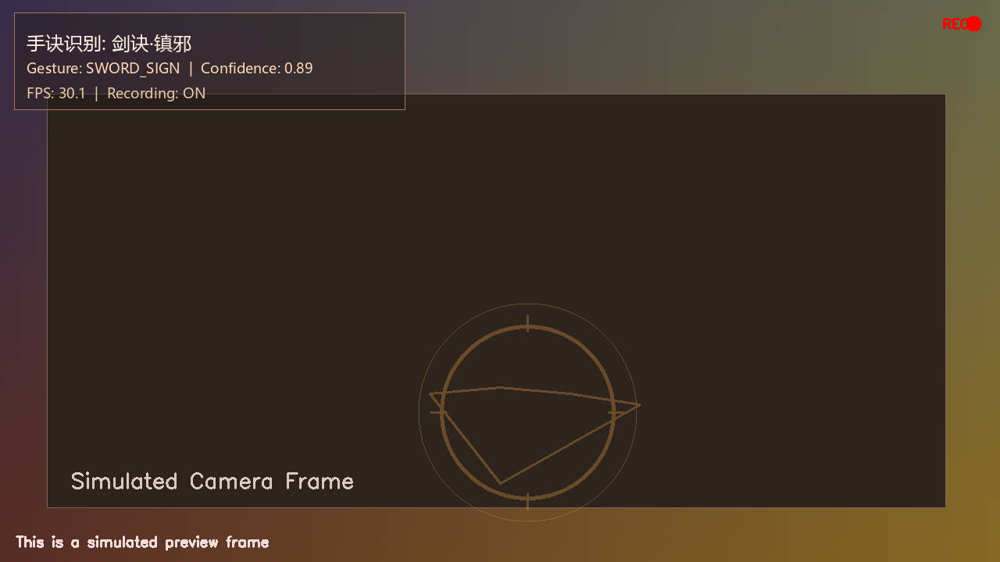
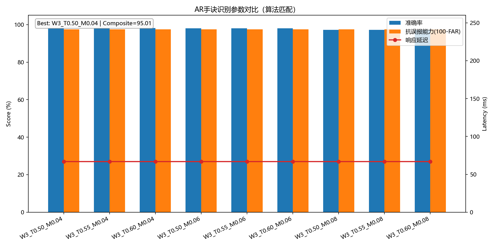

# AR Hand-Sign Demo for Nuo Opera


Realtime AR hand-sign recognition demo for Nuo Opera scenes.  
This repository focuses on runnable demo implementation and reproducible scripts.

## Demo Preview

| AR Interface Preview | Parameter Benchmark Preview |
| --- | --- |
|  |  |

## Features

- Realtime hand landmark detection with MediaPipe.
- Rule-based hand-sign recognition with confidence scoring.
- AR overlay rendering on live webcam frames.
- Screenshot and recording capture during runtime.
- Parameter benchmark utility for smoothing/threshold/margin comparison.

## Core Algorithm Design

This demo uses a lightweight rule-based recognizer on top of MediaPipe 21-point hand landmarks.

### 1) Inference Pipeline

`Frame -> Hand Landmarks (21x3) -> Feature Extraction -> Multi-gesture Scoring -> Decision Gate -> Temporal Smoothing -> AR Overlay`

### 2) Feature Extraction

Given normalized landmarks `lm`:

$$
\text{palm\_size}=\max\left(d(\mathbf{l}_0,\mathbf{l}_9),\,d(\mathbf{l}_5,\mathbf{l}_{17}),\,10^{-6}\right)
$$

$$
\text{finger\_ext}=\operatorname{clamp}\left(\frac{y_{\mathrm{pip}}-y_{\mathrm{tip}}+0.01}{0.20},\,0,\,1\right)
$$

$$
\text{thumb\_ext}=\operatorname{clamp}\left(\frac{d(\mathbf{l}_{w},\mathbf{l}_{tt})-d(\mathbf{l}_{w},\mathbf{l}_{tj})}{0.30\cdot\text{palm\_size}},\,0,\,1\right)
$$

where $\mathbf{l}_{w}$ is wrist, $\mathbf{l}_{tt}$ is thumb tip, and $\mathbf{l}_{tj}$ is thumb joint.

Core geometric features:

- `thumb_ext`, `index_ext`, `middle_ext`, `ring_ext`, `pinky_ext`
- `thumb_index` (thumb tip to index tip distance, normalized)
- `index_middle` (index tip to middle tip distance, normalized)
- `thumb_to_index_mcp` (thumb tip to index MCP distance, normalized)

### 3) Gesture Scoring (Weighted Rules)

For each gesture, score in `[0, 1]`:

- `OPEN_PALM`: high extension across five fingers + finger spread
- `SWORD_SIGN`: index/middle extended, ring/pinky folded, thumb tucked
- `PINCH_SEAL`: thumb-index close (pinch), others mostly folded
- `FIST_GUARD`: all fingers folded

Implemented as weighted linear combinations in `hand_sign_ar/recognizer.py::_score_gestures`.

For example, the open-palm score is:

$$
s_{\mathrm{open}}=
0.18\,e_{\mathrm{thumb}}+
0.20\,e_{\mathrm{index}}+
0.20\,e_{\mathrm{middle}}+
0.20\,e_{\mathrm{ring}}+
0.17\,e_{\mathrm{pinky}}+
0.05\,s_{\mathrm{spread}}
$$

### 4) Decision Gate

Let `best` be the top score and `second` the second-highest:

$$
\hat{g}=
\begin{cases}
\text{UNKNOWN}, & s_{(1)}<\tau \\
\text{UNKNOWN}, & s_{(1)}-s_{(2)}<m \\
g_{(1)}, & \text{otherwise}
\end{cases}
$$

where $\tau=\text{threshold}$ and $m=\text{margin}$.

This rejects low-confidence and ambiguous frames.

### 5) Temporal Smoothing

A sliding window weighted vote is applied:

$$
w_i=0.65+0.35\cdot\frac{i+1}{n},\quad i=0,\dots,n-1
$$

$$
\text{stability}=
\frac{\sum\limits_{i:\,g_i=\hat{g}} w_i\,c_i}
{\sum\limits_i w_i\,c_i}
$$

This suppresses jitter and improves robustness in real-time webcam noise.

### 6) Runtime Confidence Fusion

Displayed confidence combines frame-level and temporal consistency:

For known gestures:

$$
\text{conf}=\max\left(c_{\mathrm{raw}},\,0.75\cdot\text{stability}+0.25\cdot c_{\mathrm{raw}}\right)
$$

For unknown gestures:

$$
\text{conf}=\max\left(c_{\mathrm{raw}},\,0.60\cdot\text{stability}\right)
$$

### 7) Parameter-to-Logic Mapping

- `--threshold`: minimum accepted top score
- `--margin`: minimum gap between top-1 and top-2 scores
- `--smoothing`: temporal window size (larger = more stable, higher latency)
- `--min-detect`, `--min-track`: detector/tracker confidence in MediaPipe

## Project Structure

```text
.
|-- .gitignore
|-- LICENSE
|-- app.py
|-- hand_sign_ar/
|   |-- recognizer.py
|   |-- overlay.py
|   |-- benchmark.py
|   `-- __init__.py
|-- scripts/
|   |-- run_parameter_benchmark.py
|   `-- generate_ui_preview.py
|-- outputs/
|-- requirements.txt
|-- setup_venv.ps1
|-- setup_venv.bat
`-- run_demo.bat
```

## Requirements

- Windows 10/11 (PowerShell commands are provided)
- Python 3.10+
- Webcam

## Quick Start

1. Create and initialize a virtual environment:

```powershell
powershell -ExecutionPolicy Bypass -File setup_venv.ps1
```

2. Run the demo:

```powershell
.\.venv\Scripts\python.exe app.py --camera 0 --backend tasks
```

3. Or use the one-click launcher:

```powershell
.\run_demo.bat
```

## CLI Usage

```powershell
.\.venv\Scripts\python.exe app.py `
  --camera 0 `
  --width 1280 `
  --height 720 `
  --min-detect 0.65 `
  --min-track 0.60 `
  --smoothing 5 `
  --threshold 0.55 `
  --margin 0.06 `
  --output outputs `
  --backend auto
```

Key options:

- `--camera`: camera index
- `--output`: output root path for captures and recordings
- `--backend`: `auto`, `tasks`, or `solutions`
- `--smoothing`, `--threshold`, `--margin`: recognition behavior controls

## Keyboard Controls

- `Q` or `Esc`: quit
- `S`: save screenshot
- `R`: start or stop recording

## Output Files

- Default output root is `outputs/` under this folder.
- Screenshots: `outputs/screenshots/`
- Recordings: `outputs/recordings/`
- If `--output` is an absolute path (for example `C:/AR_demo_outputs`), files are written there.
- MediaPipe task model defaults to `C:/AR_demo_models/hand_landmarker.task` (can be overridden by `--task-model`).
- Sample preview images for this README are stored in `outputs/`.

## Utility Scripts

Generate parameter comparison results:

```powershell
.\.venv\Scripts\python.exe scripts/run_parameter_benchmark.py
```

Generate simulated UI preview image:

```powershell
.\.venv\Scripts\python.exe scripts/generate_ui_preview.py
```

## Troubleshooting

- Error: `A module that was compiled using NumPy 1.x cannot be run in NumPy 2.x`
  - Cause: mixed global/conda package versions.
  - Fix: use this project's `.venv` only and reinstall dependencies.
- Error: `module 'mediapipe' has no attribute 'solutions'`
  - Cause: MediaPipe API differences across versions.
  - Fix: use `--backend tasks` or `--backend auto`.

## Contributing

1. Create a feature branch.
2. Keep changes scoped and testable.
3. Open a pull request with summary, steps to run, and expected results.

## License

This project is licensed under the MIT License.  
See [LICENSE](LICENSE) for details.
